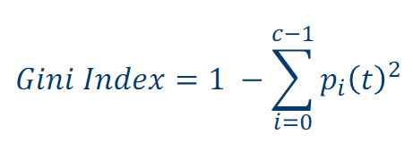

Short code to implement this formula (found in "Introduction to Data Mining 2nd Edition" by Pang-Ning Tan et al.), extended to calculate the weighted average GINI with multiple classes.

Where pi(t) is the relative frequency of training instances that belong to class i at node t, and c is the total number of classes.

